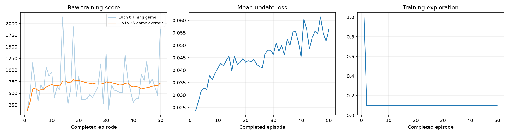
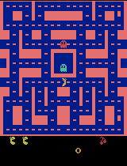
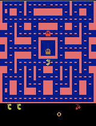

# Ms. Pac-Man DQN — Class 3 Assignment

## Delivery note

I trained the supplied Deep Q-Network on `ALE/MsPacman-v5` for 50 episodes and kept the classroom evaluation protocol unchanged. The final mean evaluation score increased from **492.0 to 514.0** (**+22.0, +4.5%**). This is a small improvement across only five games, not evidence that the agent has learned a consistently strong policy: three of the five individual scores decreased, while two increased.

The executed notebook, training log, plots, gameplay GIFs, JSON results, and playback checkpoints are included so the run can be inspected without retraining.

## Experiment choices

| Hyperparameter | Value | Reason |
|---|---:|---|
| Exploration | `0.10` | After the 1,000-decision random warm-up, 10% random actions preserve some exploration while allowing the agent to use its learned estimates most of the time. |
| Episodes | `50` | This is long enough to pass the 25-episode evidence milestone and produce two progress snapshots, while remaining practical for a local run. |
| Learning rate | `0.0001` | This conservative starting value was recommended in the assignment and reduces the risk of unstable, overly large updates. |

I expected the 10% exploration rate and small learning rate to produce gradual improvement, but also expected high variance because 50 Atari episodes are a small training budget.

Only these three values were changed in section 1 of the supplied notebook. Evaluation remained fixed at seeds `101, 202, 303, 404, 505`, 5% exploration, and a 3,000-decision time limit.

## Result

| Evaluation game | Seed | Untrained network | Trained network | Change |
|---:|---:|---:|---:|---:|
| 1 | 101 | 350 | 300 | -50 |
| 2 | 202 | 500 | 450 | -50 |
| 3 | 303 | 320 | 530 | +210 |
| 4 | 404 | 800 | 270 | -530 |
| 5 | 505 | 490 | 1,020 | +530 |
| **Mean** | — | **492.0** | **514.0** | **+22.0** |

The trained network achieved a much better result on seed 505, but performed worse on three seeds. Training scores were also noisy: the final training episode scored 1,880, while the separate seed-101 demonstrations scored 390 after episode 25 and 300 after episode 50. The dashboard shows that training score variance remained large and update loss generally rose rather than converging downward. Therefore, the most defensible conclusion is that the network weights changed and learned some useful behavior, but the improvement was weak and inconsistent.

No evaluation game hit the fixed time limit, either before or after training. The run completed normally and was not interrupted.

## Training evidence



### Before training


### Intermediate gameplay after 25 episodes



### Gameplay after 50 episodes


### Best of the five final evaluation games



The GIFs show at most the first 20 seconds of their games at accelerated playback. Scores in the table cover the complete evaluation games, so the GIFs are illustrations rather than standalone performance evidence.

## What the agent learns from

- **Observations:** four consecutive grayscale game screens, each resized to 84 × 84 pixels. A stack of frames lets the network infer motion rather than seeing only a still image.
- **Actions:** the discrete Atari joystick moves exposed by the Ms. Pac-Man environment.
- **Rewards:** changes in the game's points. Training rewards are clipped to the range `[-1, 1]`, while reported episode and evaluation scores use the original, unclipped game points.

The DQN predicts the future reward value of every available move. It stores past transitions in replay memory, learns from sampled batches, and periodically copies its learned weights to a target network.

## Run details

| Item | Actual value |
|---|---:|
| Status | Completed |
| Completed episodes | 50 / 50 |
| Agent decisions | 29,794 |
| Learning updates | 7,199 |
| Training time, including periodic demos | 128.48 seconds |
| Hardware accelerator | Apple Metal Performance Shaders (`mps`) |
| Platform | macOS 26.6, ARM64 |
| Python | 3.12.14 |
| PyTorch | 2.14.0 |

Full package versions and fixed settings are recorded in [`config.json`](results/config.json).

## Limitation and next experiment

The main observed limitation is unstable generalization: the average rose by only 22 points, and that gain was driven by one strong evaluation game while three seeds became worse. Five evaluation games and 50 training episodes are too few to distinguish a robust improvement from variance.

For the next experiment, I would change only the episode budget from **50 to 100**, keeping exploration at `0.10` and learning rate at `0.0001`. This tests whether more experience makes the improvement consistent without confounding the comparison by changing several settings at once.

## Files and reproduction

- [`pacman_dqn.ipynb`](pacman_dqn.ipynb) — final executed notebook with all outputs retained
- [`comparison.json`](results/comparison.json) — all five before/after evaluation scores
- [`config.json`](results/config.json) — chosen and fixed settings, hardware, and package versions
- [`training.csv`](results/training.csv) — one row per completed training episode
- [`training_summary.json`](results/training_summary.json) — completed episodes, decisions, updates, status, and elapsed time
- [`baseline.json`](results/baseline.json) — untrained evaluation details
- [`demo_scores.json`](results/demo_scores.json) — episode-25 and episode-50 demonstration scores
- [`episode_0025.pt`](results/episode_0025.pt), [`episode_0050.pt`](results/episode_0050.pt), and [`trained.pt`](results/trained.pt) — playback checkpoints

To reproduce the experiment locally, use Python 3.11–3.13:

```bash
python -m venv .venv
source .venv/bin/activate
python -m pip install -r requirements.txt
python -m jupyter lab pacman_dqn.ipynb
```

Open the notebook, confirm the three values in section 1, then choose **Run All**. A fresh run creates a timestamped directory and ZIP under `pacman_runs/`. The complete original ZIP from this run is retained locally; the selected grading evidence and checkpoints are published in `results/`.

## Implementation source

This submission uses the instructor-provided DQN notebook from [pepealonso95/pacman-dqn](https://github.com/pepealonso95/pacman-dqn). The supplied architecture and fixed classroom evaluation settings were not changed.
